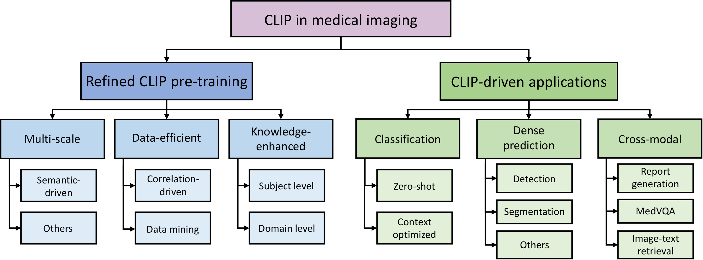

# <p align=center>`Awesome CLIP in Medical Imaging`</p>

[](https://awesome.re)
[](https://opensource.org/licenses/MIT)

:fire::fire: This is a collection of awesome articles about CLIP in medical imaging:fire::fire:

- Our survey paper on arXiv: [CLIP in medical imaging: A comprehensive survey](https://arxiv.org/abs/2312.07353)

### Citation

```python
@article{zhao2023clip,
  title={CLIP in Medical Imaging: A Comprehensive Survey},
  author={Zihao Zhao and Yuxiao Liu and Han Wu and Yonghao Li and Sheng Wang and Lin Teng and Disheng Liu and  Zhiming Cui and Qian Wang and Dinggang Shen},
  journal={arXiv preprint arXiv:2312.07353},
  year={2023},
}
```

## Overview

<p align="center">
  
  <br>
  <em>Taxonomy of studies focusing on CLIP in the field of medical imaging.</em>
</p>

- [`Awesome CLIP in Medical Imaging`](#awesome-clip-in-medical-imaging)
  - [Citation](#citation)
  - [Overview](#overview)
  - [Updates](#updates)
  - [Dataset Resource](#dataset-resource)
  - [Pre-training](#pre-training)
    - [Multi-scale](#multi-scale)
    - [Data-efficient](#data-efficient)
    - [Knowledge-enhanced](#knowledge-enhanced)
    - [Others](#others)
  - [CLIP-driven Application](#clip-driven-application)
    - [Classification](#classification)
    - [Dense Prediction](#dense-prediction)
    - [Cross-modal](#cross-modal)

## Updates

- **ArXiv preprint release:** December 13, 2023
- **Github repo release:** December 12, 2023

---

## Dataset Resource

|                                       dataset                                        |  domain   | image | text |             source              | language | pre-trained CLIP |
| :----------------------------------------------------------------------------------: | :-------: | :---: | :--: | :-----------------------------: | :------: | :--------------: |
|                   [ROCO](https://github.com/razorx89/roco-dataset)                   | multiple  |  87K  | 87K  |         research papers         |    En    |    PubMedCLIP    |
|                    [MedICaT](https://github.com/allenai/medicat)                     | multiple  | 217K  | 217K |         research papers         |    En    |        /         |
|               [PMC-OA](https://huggingface.co/datasets/axiong/pmc_oa)                | multiple  | 1.6M  | 1.6M |         research papers         |    En    |     PMC-CLIP     |
|          [ChiMed-VL](https://huggingface.co/datasets/williamliu/ChiMed-VL)           | multiple  | 580K  | 580K |         research papers         |  En/zh   |        /         |
|                     [FFA-IR](https://github.com/mlii0117/FFA-IR)                     |  fundus   |  1M   | 10K  |         medical reports         |  En/zh   |        /         |
|              [PadChest](https://bimcv.cipf.es/bimcv-projects/padchest/)              |    cxr    | 160K  | 109K |         medical reports         |    Sp    |        /         |
|             [MIMIC-CXR](https://physionet.org/content/mimic-cxr/2.0.0/)              |    cxr    | 377K  | 227K |         medical reports         |    En    | BioViL/BioViL-T  |
|          [CT-RATE](https://huggingface.co/datasets/ibrahimhamamci/CT-RATE)           | chest ct  |  50K  | 50K  |         medicla reports         |    En    |     CT-CLIP      |
| [OpenPath](https://drive.google.com/drive/folders/1b5UT8BzUphkHZavRG-fmiyY9JWYIWZER) | histology | 208K  | 208K |          social media           |    En    |       PLIP       |
|                        [Quilt-1M](https://quilt1m.github.io/)                        | histology |  1M   |  1M  | research papers<br>social media |    En    |     QuiltNet     |

---

## Pre-training

### Multi-scale

[**MICCAI 2020**] Joint Modeling of Chest Radiographs and Radiology Reports for Pulmonary Edema Assessment \
_Geeticka Chauhan, Ruizhi Liao, William Wells, Jacob Andreas, Xin Wang, Seth Berkowitz, Steven Horng, Peter Szolovits, Polina Golland_\
[[paper](https://link.springer.com/chapter/10.1007/978-3-030-59713-9_51)] [[code](https://github.com/RayRuizhiLiao/joint_chestxray)]

[**ICCV 2021**] GLoRIA: A Multimodal Global-Local Representation Learning Framework for Label-efficient Medical Image Recognition \
_Shih-Cheng Huang, Liyue Shen, Matthew P. Lungren, Serena Yeung_ \
[[paper](https://openaccess.thecvf.com/content/ICCV2021/html/Huang_GLoRIA_A_Multimodal_Global-Local_Representation_Learning_Framework_for_Label-Efficient_Medical_ICCV_2021_paper.html)] [[code](https://github.com/marshuang80/gloria)]

[**MICCAI 2021**] Multimodal Representation Learning via Maximization of Local Mutual Information \
_Ruizhi Liao, Daniel Moyer, Miriam Cha, Keegan Quigley, Seth Berkowitz, Steven Horng, Polina Golland, and William M. Wells_ \
[[paper](https://link.springer.com/chapter/10.1007/978-3-030-87196-3_26)]

[**ECCV 2022**] Joint Learning of Localized Representations from Medical Images and Reports \
_Philip Müller, Georgios Kaissis, Congyu Zou, Daniel Rückert_ \
[[paper](https://link.springer.com/chapter/10.1007/978-3-031-19809-0_39)] [[code](https://github.com/philip-mueller/lovt)]

[**ECCV 2022**] Making the Most of Text Semantics to Improve Biomedical Vision–Language Processing \
_Benedikt Boecking, Naoto Usuyama, Shruthi Bannur, Daniel C. Castro, Anton Schwaighofer, Stephanie Hyland, Maria Wetscherek, Tristan Naumann, Aditya Nori, Javier Alvarez-Valle, Hoifung Poon, and Ozan Oktay_ \
[[paper](https://link.springer.com/chapter/10.1007/978-3-031-20059-5_1)] [[code](https://hi-ml.readthedocs.io/en/latest/multimodal.html)]

[**NeurIPS 2022 Workshop**] The Role of Local Alignment and Uniformity in Image-Text Contrastive Learning on Medical Images \
_Philip Müller, Georgios Kaissis, Daniel Rueckert_ \
[[paper](https://sslneurips22.github.io/pages/accepted-paper.html)]

[**MICCAI 2022**] Breaking with Fixed Set Pathology Recognition through Report-Guided Contrastive Training \
_Constantin Seibold, Simon Reiß, M. Saquib Sarfraz, Rainer Stiefelhagen, Jens Kleesiek_ \
[[paper](https://link.springer.com/chapter/10.1007/978-3-031-16443-9_66)]

[**MICCAI 2022**] Vision-Language Contrastive Learning Approach to Robust Automatic Placenta Analysis Using Photographic Images \
_Yimu Pan, Alison D. Gernand, Jeffery A. Goldstein, Leena Mithal, Delia Mwinyelle, James Z. Wang_ \
[[paper](https://link.springer.com/chapter/10.1007/978-3-031-16437-8_68)]

[**ICLR 2023**] Advancing Radiograph Representation Learning with Masked Record Modeling \
_Hong-Yu Zhou, Chenyu Lian, Liansheng Wang, Yizhou Yu_ \
[[paper](https://openreview.net/forum?id=w-x7U26GM7j)] [[code](https://github.com/RL4M/MRM-pytorch)]

[**ICCV 2023**] LIMITR: Leveraging Local Information for Medical Image-Text Representation \
_Gefen Dawidowicz, Elad Hirsch, Ayellet Tal_ \
[[paper](https://arxiv.org/abs/2303.11755)] [[code](https://github.com/gefend/LIMITR)]

[**ICCV 2023**] PRIOR: Prototype Representation Joint Learning from Medical Images and Reports \
_Pujin Cheng, Li Lin, Junyan Lyu, Yijin Huang, Wenhan Luo, Xiaoying Tang_ \
[[paper](https://openaccess.thecvf.com/content/ICCV2023/html/Cheng_PRIOR_Prototype_Representation_Joint_Learning_from_Medical_Images_and_Reports_ICCV_2023_paper.html)] [[code](https://github.com/QtacierP/PRIOR)]

[**MICCAI 2023**] Contrastive Masked Image-Text Modeling for Medical Visual Representation Learning \
_Cheng Chen, Aoxiao Zhong, Dufan Wu, Jie Luo, Quanzheng Li_ \
[[paper](https://link.springer.com/chapter/10.1007/978-3-031-43904-9_48)] [[code](https://github.com/cchen-cc/CMITM)]

[**MICCAI 2023**] Enhancing Automatic Placenta Analysis through Distributional Feature Recomposition in Vision-Language Contrastive Learning \
Yimu Pan, Tongan Cai, Manas Mehta, Alison D. Gernand, Jeffery A. Goldstein, Leena Mithal, Delia Mwinyelle, Kelly Gallagher, James Z. Wang \
[[paper](https://link.springer.com/chapter/10.1007/978-3-031-43987-2_12)]

[**MICCAI 2023**] MedIM: Boost Medical Image Representation via Radiology Report-Guided Masking \
_Yutong Xie, Lin Gu, Tatsuya Harada, Jianpeng Zhang, Yong Xia, Qi Wu_ \
[[paper](https://link.springer.com/chapter/10.1007/978-3-031-43907-0_2)] [[code](https://github.com/YtongXie/MedIM)]

[**MLHC 2023**] TIER: Text-Image Entropy Regularization for Medical CLIP-style models \
_Anil Palepu, Andrew Beam_ \
[[paper](https://arxiv.org/abs/2212.06710)] [[code](https://github.com/apalepu13/TIER_Regularized_CLIP)]

[**EMNLP 2023**] Fine-grained Medical Vision-Language Representation Learning for Radiology Report Generation \
_Siyuan Wang, Bo Peng, Yichao Liu, Qi Peng_ \
[[paper](https://aclanthology.org/2023.emnlp-main.989/)]

[**MedIA 2023**] Self-supervised multi-modal training from uncurated images and reports enables monitoring AI in radiology \
_Sangjoon Park, Eun Sun Lee, Kyung Sook Shin, Jeong Eun Lee, Jong Chul Ye_ \
[[paper](https://www.sciencedirect.com/science/article/abs/pii/S1361841523002815)]

[**TMM 2023**] Multi-task Paired Masking with Alignment Modeling for Medical Vision-Language Pre-training \
_Ke Zhang, Yan Yang, Jun Yu, Hanliang Jiang, Jianping Fan, Qingming Huang, Weidong Han_ \
[[paper](https://ieeexplore.ieee.org/abstract/document/10288259)]

[**ESA 2023**] MITER: Medical Image–TExt joint adaptive pretRaining with multi-level contrastive learning \
_Chang Shu, Yi Zhu, Xiaochu Tang, Jing Xiao, Youxin Chen, Xiu Li, Qian Zhang, Zheng Lu_ \
[[paper](https://www.sciencedirect.com/science/article/pii/S0957417423020286)] [[code](https://github.com/ZhuYi98/MITER)]

[**CVPR 2024**] CARZero: Cross-Attention Alignment for Radiology Zero-Shot Classification\
_Haoran Lai, Qingsong Yao, Zihang Jiang, Rongsheng Wang, Zhiyang He, Xiaodong Tao, S. Kevin Zhou_ \
[[paper](https://openaccess.thecvf.com/content/CVPR2024/papers/Lai_CARZero_Cross-Attention_Alignment_for_Radiology_Zero-Shot_Classification_CVPR_2024_paper.pdf)]

[**arXiv 2023**] Local Contrastive Learning for Medical Image Recognition \
_Syed A. Rizvi, Ruixiang Tang, Xiaoqian Jiang, Xiaotian Ma, Xia Hu_ \
[[paper](https://arxiv.org/abs/2303.14153)]

[**arXiv 2023**] G2D: From Global to Dense Radiography Representation Learning via
Vision-Language Pre-training \
_Che Liu, Cheng Ouyang, Sibo Cheng, Anand Shah, Wenjia Bai, Rossella Arcucci_ \
[[paper](https://arxiv.org/abs/2312.01522)]

[**arXiv 2023**] Fine-Grained Image-Text Alignment in Medical Imaging
Enables Cyclic Image-Report Generation \
_Wenting Chen, Xiang Li, Linlin Shen, Yixuan Yuan_ \
[[paper](https://arxiv.org/abs/2312.08078)]

[**IEEE TMI 2024**] Multi-Grained Radiology Report Generation With Sentence-Level Image-Language Contrastive Learning \
_Aohan Liu,Yuchen Guo,Jun-Hai Yong,Feng Xu_ \
[[paper](https://arxiv.org/abs/2401.10501)]

[**ICML 2024**] Unlocking the Power of Spatial and Temporal Information in Medical Multimodal Pre-training \
_Jinxia Yang, Bing Su, Wayne Xin Zhao, Ji-Rong Wen_ \
[[paper](https://arxiv.org/pdf/2405.19654)]

[**arXiv 2024**] MeDSLIP: Medical Dual-Stream Language-Image Pre-training for Fine-grained Alignment \
_Wenrui Fan, Mohammod Naimul Islam Suvon, Shuo Zhou, Xianyuan Liu, Samer Alabed, Venet Osmani, Andrew Swift, Chen Chen, Haiping Lu_ \
[[paper](https://arxiv.org/pdf/2403.10635)]

[**arXiv 2024**] Anatomical Structure-Guided Medical Vision-Language Pre-training \
_Qingqiu Li, Xiaohan Yan, Jilan Xu, Runtian Yuan, Yuejie Zhang, Rui Feng, Quanli Shen, Xiaobo Zhang, Shujun Wang_ \
[[paper](https://arxiv.org/pdf/2403.09294)]

[**arXiv 2024**] CT-GLIP: 3D Grounded Language-Image Pretraining with CT Scans and Radiology Reports for Full-Body Scenarios \
_Jingyang Lin, Yingda Xia, Jianpeng Zhang, Ke Yan, Le Lu, Jiebo Luo, Ling Zhang_ \
[[paper](https://arxiv.org/pdf/2404.15272)]

[**arXiv 2024**] Enhancing medical vision-language contrastive learning via inter-matching relation modelling \
_Mingjian Li, Mingyuan Meng, Michael Fulham, David Dagan Feng, Lei Bi, Jinman Kim_ \
[[paper](https://arxiv.org/pdf/2401.10501)]

[**arXiv 2024**] Multi-modal vision-language model for generalizable annotation-free pathology localization and clinical diagnosis\
_Hao Yang, Hong-Yu Zhou, Zhihuan Li, Yuanxu Gao, Cheng Li, Weijian Huang, Jiarun Liu, Hairong Zheng, Kang Zhang, Shanshan Wang_ \
[[paper](https://arxiv.org/abs/2401.02044v4)]

[**arXiv 2024**] Enhancing Representation in Medical Vision-Language Foundation Models via Multi-Scale Information Extraction Techniques \
_Weijian Huang, Cheng Li, Hong-Yu Zhou, Jiarun Liu, Hao Yang, Yong Liang, Guangming Shi, Hairong Zheng, Shanshan Wang_ \
[[paper](https://arxiv.org/pdf/2401.01583)]

[**arXiv 2024**] MLIP: Medical Language-Image Pre-training with Masked Local Representation Learning \
_Jiarun Liu, Hong-Yu Zhou, Cheng Li, Weijian Huang, Hao Yang, Yong Liang, Shanshan Wang_ \
[[paper](https://arxiv.org/abs/2401.01591)]

[**arXiv 2024**] Multimodal self-supervised learning for lesion localization \
_Hao Yang, Hong-Yu Zhou, Cheng Li, Weijian Huang, Jiarun Liu, Yong Liang, Shanshan Wang_ \
[[paper](https://arxiv.org/abs/2401.01524)]


---

### Data-efficient

[**EMNLP 2022**] MedCLIP: Contrastive Learning from Unpaired Medical Images and Text \
_Zifeng Wang, Zhenbang Wu, Dinesh Agarwal, Jimeng Sun_ \
[[paper](https://www.google.com.hk/url?sa=t&rct=j&q=&esrc=s&source=web&cd=&cad=rja&uact=8&ved=2ahUKEwiwuqrXjvWCAxWriVYBHR8TCN8QFnoECAsQAQ&url=https%3A%2F%2Faclanthology.org%2F2022.emnlp-main.256.pdf&usg=AOvVaw0Ph_QYrWg8OUoQBvfvSXoq&opi=89978449)] [[code](https://github.com/RyanWangZf/MedCLIP)]

[**NeurIPS 2022**] Multi-Granularity Cross-modal Alignment for Generalized Medical Visual Representation Learning \
_Fuying Wang, Yuyin Zhou, Shujun Wang, Varut Vardhanabhuti, Lequan Yu_ \
[[paper](https://proceedings.neurips.cc/paper_files/paper/2022/hash/d925bda407ada0df3190df323a212661-Abstract-Conference.html)] [[code](https://github.com/HKU-MedAI/MGCA)]

[**ISBRA 2023**] TCSA: A Text-Guided Cross-View Medical Semantic Alignment Framework for Adaptive Multi-view Visual Representation Learning \
_Hongyang Lei, Huazhen Huang, Bokai Yang, Guosheng Cui, Ruxin Wang, Dan Wu , and Ye Li_ \
[[paper](https://link.springer.com/chapter/10.1007/978-981-99-7074-2_11#auth-Hongyang-Lei)]

[**CVPR 2023**] Learning to Exploit Temporal Structure for Biomedical Vision–Language Processing \
_Shruthi Bannur,∗ Stephanie Hyland∗, Qianchu Liu, Fernando P ́ erez-Garc ́ıa, Maximilian Ilse, Daniel C. Castro, Benedikt Boecking, Harshita Sharma, Kenza Bouzid, Anja Thieme, Anton Schwaighofer, Maria Wetscherek, Matthew P. Lungren, Aditya Nori Javier Alvarez-Valle, Ozan Oktay_ \
[[paper](https://openaccess.thecvf.com/content/CVPR2023/html/Bannur_Learning_To_Exploit_Temporal_Structure_for_Biomedical_Vision-Language_Processing_CVPR_2023_paper.html)] [[code](https://github.com/microsoft/hi-ml/tree/main/hi-ml-multimodal)]

[**MICCAI 2023**] CXR-CLIP: Toward Large Scale Chest X-ray Language-Image Pre-training \
_Kihyun You, Jawook Gu, Jiyeon Ham, Beomhee Park, Jiho Kim, Eun K. Hong, Woonhyuk Baek, Byungseok Roh_ \
[[paper](https://link.springer.com/chapter/10.1007/978-3-031-43895-0_10)] [[code](https://github.com/kakaobrain/cxr-clip)]

[**TMI 2023**] Improving Medical Vision-Language Contrastive
Pretraining with Semantics-aware Triage \
_Bo Liu, Donghuan Lu, Dong Wei, Xian Wu, Yan Wang, Yu Zhang, Yefeng Zheng_ \
[[paper](https://ieeexplore.ieee.org/document/10182304)]

[**QIMS 2023**] SDA-CLIP: surgical visual domain adaptation using video and text labels \
_Yuchong Li, Shuangfu Jia, Guangbi Song, Ping Wang, Fucang Jia_ \
[[paper](https://qims.amegroups.org/article/view/117648/html)] [[code](https://github.com/Lycus99/SDA-CLIP)]

[**arXiv 2023**] UniBrain: Universal Brain MRI Diagnosis with Hierarchical Knowledge-enhanced Pre-training \
_Jiayu Lei, Lisong Dai, Haoyun Jiang, Chaoyi Wu, Xiaoman Zhang, Yao Zhang, Jiangchao Yao, Weidi Xie, Yanyong Zhang, Yuehua Li, Ya Zhang, Yanfeng Wang_ \
[[paper](https://arxiv.org/abs/2309.06828)] [[code](https://github.com/ljy19970415/UniBrain)]

[**arXiv 2023**] Unified Medical Image-Text-Label Contrastive Learning With Continuous Prompt \
_Yuhao Wang_ \
[[paper](https://arxiv.org/abs/2307.05920)]

[**arXiv 2023**] Significantly Improving Zero-Shot X-ray Pathology Classification via Fine-tuning Pre-trained Image-Text Encoders \
_Jongseong Jang∗, Daeun Kyung∗, Seung Hwan Kim, Honglak Lee, Kyunghoon Bae, Edward Choi_ \
[[paper](https://arxiv.org/abs/2212.07050)]

[**arXiv 2023**] IMITATE: Clinical Prior Guided Hierarchical Vision-Language Pre-training \
_Che Liu, Sibo Cheng, Miaojing Shi, Anand Shah, Wenjia Bai, Rossella Arcucci_ \
[[paper](https://arxiv.org/abs/2310.07355)]

[**CVPR 2024**] PairAug: What Can Augmented Image-Text Pairs Do for Radiology? \
_Yutong Xie, Qi Chen, Sinuo Wang, Minh-Son To, Iris Lee, Ee Win Khoo, Kerolos Hendy, Daniel Koh, Yong Xia, Qi Wu_ \
[[paper](https://openaccess.thecvf.com/content/CVPR2024/papers/Xie_PairAug_What_Can_Augmented_Image-Text_Pairs_Do_for_Radiology_CVPR_2024_paper.pdf)]

[**CVPR 2024**] Bootstrapping Chest CT Image Understanding by Distilling Knowledge from X-ray Expert Models \
_Weiwei Cao, Jianpeng Zhang, Yingda Xia, Tony C. W. Mok, Zi Li, Xianghua Ye, Le Lu, Jian Zheng, Yuxing Tang, Ling Zhang_ \
[[paper](https://openaccess.thecvf.com/content/CVPR2024/papers/Cao_Bootstrapping_Chest_CT_Image_Understanding_by_Distilling_Knowledge_from_X-ray_CVPR_2024_paper.pdf)]

[**CVPR 2024**] Decomposing Disease Descriptions for Enhanced Pathology Detection: A Multi-Aspect Vision-Language Pre-training Framework \
_Vu Minh Hieu Phan, Yutong Xie, Yuankai Qi, Lingqiao Liu, Liyang Liu, Bowen Zhang, Zhibin Liao, Qi Wu, Minh-Son To, Johan W. Verjans_ \
[[paper](https://openaccess.thecvf.com/content/CVPR2024/papers/Phan_Decomposing_Disease_Descriptions_for_Enhanced_Pathology_Detection_A_Multi-Aspect_Vision-Language_CVPR_2024_paper.pdf)]

[**MICCAI 2024**] RET-CLIP: A Retinal Image Foundation Model Pre-trained with Clinical Diagnostic Reports \
_Jiawei Du, Jia Guo, Weihang Zhang, Shengzhu Yang, Hanruo Liu, Huiqi Li, Ningli Wang_ \
[[paper](https://arxiv.org/pdf/2405.14137)]

[**MICCAI 2024**] Mammo-CLIP: A Vision Language Foundation Model to Enhance Data Efficiency and Robustness in Mammography \
_Shantanu Ghosh, Clare B. Poynton, Shyam Visweswaran, Kayhan Batmanghelich_ \
[[paper](https://arxiv.org/pdf/2405.12255)]

[**CVPR 2024**] CPLIP: Zero-Shot Learning for Histopathology with Comprehensive Vision-Language Alignment \
_Sajid Javed, Arif Mahmood, Iyyakutti Iyappan Ganapathi, Fayaz Ali Dharejo, Naoufel Werghi, Mohammed Bennamoun_ \
[[paper](https://openaccess.thecvf.com/content/CVPR2024/papers/Javed_CPLIP_Zero-Shot_Learning_for_Histopathology_with_Comprehensive_Vision-Language_Alignment_CVPR_2024_paper.pdf)]

[**CAI 2024**] Enhancing Biomedical Multi-modal Representation Learning with Multi-scale Pre-training and Perturbed Report Discrimination \
_X Zhong, K Batmanghelich, L Sun_ \
[[paper](https://ieeecai.org/2024/wp-content/pdfs/540900a486/540900a486.pdf)]

[**arXiv 2024**] Eye-gaze Guided Multi-modal Alignment for Medical Representation Learning \
_Chong Ma, Hanqi Jiang, Wenting Chen, Yiwei Li, Zihao Wu, Xiaowei Yu, Zhengliang Liu, Lei Guo, Dajiang Zhu, Tuo Zhang, Dinggang Shen, Tianming Liu, Xiang Li_ \
[[paper](https://arxiv.org/pdf/2403.12416)]

[**arXiv 2024**] Design as Desired: Utilizing VQA for Multimodal Pre-training \
_Tongkun Su, Jun Li, Xi Zhang, Haibo Jin, Hao Chen, Qiong Wang, Faqin Lv, Baoliang Zhao, Yin Hu_ \
[[paper](https://arxiv.org/pdf/2404.00226)]

[**arXiv 2024**] Merlin: A Vision Language Foundation Model for 3D Computed Tomography \
_Louis Blankemeier, Joseph Paul Cohen, Ashwin Kumar, Dave Van Veen, Syed Jamal Safdar Gardezi, Magdalini Paschali, Zhihong Chen, Jean-Benoit Delbrouck, Eduardo Reis, Cesar Truyts, Christian Bluethgen, Malte Engmann Kjeldskov Jensen, Sophie Ostmeier, Maya Varma, Jeya Maria Jose Valanarasu, Zhongnan Fang, Zepeng Huo, Zaid Nabulsi, Diego Ardila, Wei-Hung Weng, Edson Amaro Junior, Neera Ahuja, Jason Fries, Nigam H. Shah, Andrew Johnston, Robert D. Boutin, Andrew Wentland, Curtis P. Langlotz, Jason Hom, Sergios Gatidis, Akshay S. Chaudhari_ \
[[paper](https://arxiv.org/pdf/2406.06512)]

[**arXiv 2024**] AliFuse: Aligning and Fusing Multi-modal Medical Data for Computer-Aided Diagnosis \
_Qiuhui Chen, Xinyue Hu, Zirui Wang, Yi Hong_ \
[[paper](https://arxiv.org/abs/2401.01074)]

---

### Knowledge-enhanced

[**ACM MM 2022**] Align, Reason and Learn: Enhancing Medical Vision-and-Language Pre-training with Knowledge \
_Zhihong Chen, Guanbin Li, Xiang Wan_ \
[[paper](https://arxiv.org/abs/2209.07118)] [[code](https://github.com/zhjohnchan/ARL)]

[**ICCV 2023**] MedKLIP: Medical Knowledge Enhanced Language-Image Pre-Training for X-ray Diagnosis \
_Chaoyi Wu, Xiaoman Zhang, Ya Zhang, Yanfeng Wang, Weidi Xie_ \
[[paper](https://arxiv.org/abs/2301.02228)] [[code](https://github.com/MediaBrain-SJTU/MedKLIP)]

[**MICCAI 2023**] Knowledge Boosting: Rethinking Medical Contrastive Vision-Language Pre-Training \
_Xiaofei Chen, Yuting He, Cheng Xue, Rongjun Ge, Shuo Li, Guanyu Yang_ \
[[paper](https://link.springer.com/chapter/10.1007/978-3-031-43907-0_39)] [[code](https://github.com/ChenXiaoFei-CS/KoBo)]

[**Nature Communication 2023**] Knowledge-enhanced visual-language pre-training on chest radiology images \
_Xiaoman Zhang, Chaoyi Wu, Ya Zhang, WeidiXie & Yanfeng Wang_ \
[[paper](https://www.nature.com/articles/s41467-023-40260-7)] [[code](https://github.com/xiaoman-zhang/KAD)]

[**npj digital medicine 2023**] A medical multimodal large language model for future pandemics \
_Fenglin Liu, Tingting Zhu, Xian Wu, Bang Yang, Chenyu You, Chenyang Wang, Yefeng Zheng, Xu Sun, Yang Yang, Lei Clifton, David A. Clifton_ \
[[paper](https://www.nature.com/articles/s41746-023-00952-2)]

[**arXiv 2023**] Towards Medical Artificial General Intelligence via Knowledge-Enhanced Multimodal Pretraining \
_Bingqian Lin, Zicong Chen, Mingjie Li, Haokun Lin, Hang Xu, Yi Zhu, Jianzhuang Liu, Wenjia Cai, Lei Yang, Shen Zhao, Chenfei Wu, Ling Chen, Xiaojun Chang, Yi Yang, Lei Xing, Xiaodan Liang_ \
[[paper](https://arxiv.org/abs/2304.14204)] [[code](https://github.com/chenzcv7/MOTOR)]

[**arXiv 2023**] A Foundation LAnguage-Image model of the Retina (FLAIR): Encoding expert knowledge in text supervision \
_Julio Silva-Rodriguez, Hadi Chakor, Riadh Kobbi, Jose Dolz, Ismail Ben Ayed_ \
[[paper](https://arxiv.org/abs/2308.07898)] [[code](https://github.com/jusiro/FLAIR)]

[**arXiv 2024**] MedFLIP: Medical Vision-and-Language Self-supervised Fast Pre-Training with Masked Autoencoder \
_Lei Li, Tianfang Zhang, Xinglin Zhang, Jiaqi Liu, Bingqi Ma, Yan Luo, Tao Chen_ \
[[paper](https://arxiv.org/pdf/2403.04626)]

[**arXiv 2024**] Knowledge-enhanced Visual-Language Pretraining for Computational Pathology \
_Xiao Zhou, Xiaoman Zhang, Chaoyi Wu, Ya Zhang, Weidi Xie, Yanfeng Wang_ \
[[paper](https://arxiv.org/pdf/2404.09942)]

[**arXiv 2024**] Knowledge-grounded Adaptation Strategy for Vision-language Models: Building Unique Case-set for Screening Mammograms for Residents Training \
_Aisha Urooj Khan, John Garrett, Tyler Bradshaw, Lonie Salkowski, Jiwoong Jason Jeong, Amara Tariq, Imon Banerjee_ \
[[paper](https://arxiv.org/pdf/2405.19675)]

[**arXiv 2024**] Grounded Knowledge-Enhanced Medical VLP for Chest X-Ray \
_Qiao Deng, Zhongzhen Huang, Yunqi Wang, Zhichuan Wang, Zhao Wang, Xiaofan Zhang, Qi Dou, Yeung Yu Hui, Edward S.Hui_ \
[[paper](https://arxiv.org/pdf/2404.14750)]

[**arXiv 2024**] Enhancing the vision-language foundation model with key semantic knowledge-emphasized report refinement \
_Cheng Li, Weijian Huang, Hao Yang, Jiarun Liu, Shanshan Wang_ \
[[paper](https://arxiv.org/pdf/2401.11421)]

[**arXiv 2024**] MLIP: Enhancing Medical Visual Representation with Divergence Encoder and Knowledge-guided Contrastive Learning \
_Zhe Li, Laurence T. Yang, Bocheng Ren, Xin Nie, Zhangyang Gao, Cheng Tan, Stan Z. Li_ \
[[paper](https://arxiv.org/abs/2402.02045)]

[**arXiv 2024**] DeViDe: Faceted medical knowledge for improved medical vision-language pre-training \
_H Luo, Z Zhou, C Royer, A Sekuboyina, B Menze_ \
[[paper](https://arxiv.org/pdf/2404.03618)]

---

### Others

[**MLHC 2022**] Contrastive Learning of Medical Visual Representations from Paired Images and Text \
_Yuhao Zhang, Hang Jiang, Yasuhide Miura, Christopher D. Manning, Curtis P. Langlotz_ \
[[paper](https://proceedings.mlr.press/v182/zhang22a.html)] [[code](https://github.com/edreisMD/ConVIRT-pytorch)]

[**NMI 2022**] Generalized radiograph representation learning via cross-supervision between images and free-text radiology reports\
_Hong-Yu Zhou, Xiaoyu Chen, Yinghao Zhang, Ruibang Luo, Liansheng Wang, Yizhou Yu_ \
[[paper](https://www.nature.com/articles/s42256-021-00425-9)] [[code](https://github.com/funnyzhou/REFERS)]

[**ICCV 2023**] Towards Unifying Medical Vision-and-Language Pre-Training via Soft Prompts \
_Zhihong Chen, Benyou Wang, Shizhe Diao, Guanbin Li, Xiang Wan_ \
[[paper](https://arxiv.org/abs/2302.08958)] [[code](https://github.com/zhjohnchan/ptunifier)]

[**ICCV 2023**] Cross-Modal Translation and Alignment for Survival Analysis \
_Fengtao Zhou, Hao Chen_ \
[[paper](https://www.google.com.hk/url?sa=t&rct=j&q=&esrc=s&source=web&cd=&cad=rja&uact=8&ved=2ahUKEwi9ibPDn4SDAxUP_WEKHWVZB6kQFnoECA0QAw&url=https%3A%2F%2Fopenaccess.thecvf.com%2Fcontent%2FICCV2023%2Fpapers%2FZhou_Cross-Modal_Translation_and_Alignment_for_Survival_Analysis_ICCV_2023_paper.pdf&usg=AOvVaw0M39tXtqEkk3BQUCKASxwn&opi=89978449)] [[code](https://github.com/ft-zhou-zzz/cmta)]

[**NeurIPS 2023**] Med-UniC: Unifying Cross-Lingual Medical Vision-Language Pre-Training by Diminishing Bias \
_Zhongwei Wan, Che Liu, Mi Zhang, Jie Fu, Benyou Wang, Sibo Cheng, Lei Ma, César Quilodrán-Casas, Rossella Arcucci_ \
[[paper](https://arxiv.org/abs/2305.19894)] [[code](https://github.com/sustechbruce/med-unic)]

[**MICCAI 2023**] M-FLAG: Medical Vision-Language Pre-training with Frozen Language Models and Latent Space Geometry Optimization \
_Che Liu, Sibo Cheng, Chen Chen, Mengyun Qiao, Weitong Zhang, Anand Shah, Wenjia Bai, Rossella Arcucci_ \
[[paper](https://link.springer.com/chapter/10.1007/978-3-031-43907-0_61)] [[code](https://github.com/cheliu-computation/M-FLAG-MICCAI2023)]

[**MICCAI 2023**] Pathology-and-genomics Multimodal Transformer for Survival Outcome Prediction \
_Kexin Ding, Mu Zhou, Dimitris N. Metaxas, Shaoting Zhang_ \
[[paper](https://link.springer.com/chapter/10.1007/978-3-031-43987-2_60)] [[code](https://github.com/Cassie07/PathOmics)]

[**MICCAI 2023**] Surgical Video Captioning with Mutual-Modal Concept Alignment \
_Zhen Chen, Qingyu Guo, Leo K. T. Yeung, Danny T. M. Chan, Zhen Lei, Hongbin Liu & Jinqiao Wang_ \
[[paper](https://link.springer.com/chapter/10.1007/978-3-031-43996-4_3)] [[code](https://github.com/franciszchen/SCA-Net)]

[**ICASSP 2024**] Freeze the backbones: A Parameter-Efficient Contrastive Approach to Robust Medical Vision-Language Pre-training \
_Jiuming Qin, Che Liu, Sibo Cheng, Yike Guo, Rossella Arcucci_ \
[[paper](https://arxiv.org/abs/2401.01179)]

[**arXiv 2023**] Utilizing Synthetic Data for Medical Vision-Language Pre-training: Bypassing the Need for Real Images \
_Che Liu, Anand Shah, Wenjia Bai, Rossella Arcucci_ \
[[paper](https://arxiv.org/abs/2310.07027)]

[**IEEE TMI 2024**] UniChest: Conquer-and-Divide Pre-training for Multi-Source Chest X-Ray Classification \
_T Dai, R Zhang, F Hong, J Yao, Y Zhang_ \
[[paper](https://arxiv.org/pdf/2312.11038)]

[**ICASSP 2024**] Freeze the Backbones: a Parameter-Efficient Contrastive Approach to Robust Medical Vision-Language Pre-Training \
_C Liu, S Cheng, Y Guo, R Arcucci_ \
[[paper](https://arxiv.org/pdf/2401.01179)]

[**SaTML 2024**] Backdoor Attack on Un-paired Medical Image-Text Pretrained Models: A Pilot Study on MedCLIP \
_R Jin, CY Huang, C You, X Li_ \
[[paper](https://openreview.net/pdf?id=YymNvIkmKR)]

[**Nature Medicine 2024**] Vision–language foundation model for echocardiogram interpretation \
_M Christensen, M Vukadinovic, N Yuan, D Ouyang_ \
[[paper](https://www.nature.com/articles/s41591-024-02959-y.pdf)]

[**arXiv 2024**] Align as Ideal: Cross-Modal Alignment Binding for Federated Medical Vision-Language Pre-training \
_Zitao Shuai, Liyue Shen_ \
[[paper](https://arxiv.org/pdf/2404.03854)]

[**arXiv 2024**] MEDBind: Unifying Language and Multimodal Medical Data Embeddings \
_Yuan Gao, Sangwook Kim, David E Austin, Chris McIntosh_ \
[[paper](https://arxiv.org/pdf/2403.12894)]

[**arXiv 2024**] Open Challenges and Opportunities in Federated Foundation Models Towards Biomedical Healthcare \
_Xingyu Li, Lu Peng, Yuping Wang, Weihua Zhang_ \
[[paper](https://arxiv.org/pdf/2405.06784)]

[**arXiv 2024**] Medical Vision-Language Pre-Training for Brain Abnormalities \
_Masoud Monajatipoor, Zi-Yi Dou, Aichi Chien, Nanyun Peng, Kai-Wei Chang_ \
[[paper](https://arxiv.org/pdf/2404.17779)]

[**arXiv 2024**] Benchmarking PathCLIP for Pathology Image Analysis \
_Sunyi Zheng, Xiaonan Cui, Yuxuan Sun, Jingxiong Li, Honglin Li, Yunlong Zhang, Pingyi Chen, Xueping Jing, Zhaoxiang Ye, Lin Yang_\
[[paper](https://arxiv.org/abs/2401.02651)]

---

## CLIP-driven Application

### Classification

[**MICCAI 2022**] CLIP-Lung: Textual Knowledge-Guided Lung Nodule Malignancy Prediction \
_Yiming Lei, Zilong Li, Yan Shen, Junping Zhang, Hongming Shan_ \
[[paper](https://link.springer.com/chapter/10.1007/978-3-031-43990-2_38)] \[[code](https://github.com/ymLeiFDU/CLIP-Lung)]

[**ACL 2022**] Language over Labels: Contrastive Language Supervision Exceeds Purely Label-Supervised Classification Performance on Chest X-Rays \
_Anton Wiehe, Florian Schneider, Sebastian Blank, Xintong Wang, Hans-Peter Zorn, Christian Biemann_ \
[[paper](https://aclanthology.org/2022.aacl-srw.11.pdf)] \[[code](https://github.com/NotNANtoN/master_thesis)]

[**ICCE-Asia 2022**] Transfer Learning for Medical Image Classification on Multiple Datasets using PubMedCLIP \
_Hong N. Dao, Tuyen Nguyen Quang, Incheon Paik_ \
[[paper](https://ieeexplore.ieee.org/stamp/stamp.jsp?tp=&arnumber=9954669)]

[**Nature BME 2022**] Expert-level detection of pathologies from unannotated chest X-ray images via self-supervised learning \
_Ekin Tiu, Ellie Talius, Pujan Patel, Curtis P. Langlotz, Andrew Y. Ng & Pranav Rajpurkar_ \
[[paper](https://www.nature.com/articles/s41551-022-00936-9)] \[[code](https://github.com/rajpurkarlab/CheXzero)]

[**ISBI 2023**] Self-Supervised Learning with Radiology Reports, A Comparative Analysis of Strategies for Large Vessel Occlusion and Brain CTA Images \
_S Pachade, S Datta, Y Dong, S Salazar-Marioni, R Abdelkhaleq, A Niktabe, K Roberts, SA Sheth, L Giancardo_ \
[[paper](https://ieeexplore.ieee.org/abstract/document/10230623)]

[**ISBI 2023**] Joint representation learning from french radiological
reports and ultrasound images \
_Hind Dadoun, Hervé Delingette, Anne-Laure Rousseau, Eric de Kerviler, Nicholas Ayache_ \
[[paper](https://ieeexplore.ieee.org/document/10230642)]

[**ISBI 2023**] Multimodal Representation Learning for Blastocyst Assessment \
_Youcheng Wang, Zhe Zheng, Na Ni, Guoqing Tong, Nuo Cheng, Kai Li, Ping Yin, Yuanyuan Chen, Yingna Wu, Guangping Xie_ \
[[paper](https://ieeexplore.ieee.org/abstract/document/10230468)]

[**CEUR Workshop 2023**] Multi-stage Medical Image Captioning using Classification and CLIP \
_Masaki Aono, Hiroki Shinoda, Tetsuya Asakawa, Kazuki Shimizu, Takuya Togawa, Takuyuki Komoda_ \
[[paper](https://ceur-ws.org/Vol-3497/paper-113.pdf)]

[**MIDL 2023**] Improving Zero-Shot Detection of Low Prevalence Chest Pathologies using Domain Pre-trained Language Models \
_Yuhao Zhang, Hang Jiang, Yasuhide Miura, Christopher D. Manning, Curtis P. Langlotz_ \
[[paper](https://proceedings.mlr.press/v182/zhang22a.html)] \[[code](https://github.com/yuhaozhang/convirt)]

[**MIDL 2023**] MEDIMP: 3D Medical Images with clinical Prompts from limited tabular data for renal transplantation \
_Leo Milecki, Vicky Kalogeiton, Sylvain Bodard, Dany Anglicheau, Jean-Michel Correas, Marc-Olivier Timsit, Maria Vakalopoulou_ \
[[paper](https://centralesupelec.hal.science/hal-04040697v2/document)] \[[code](https://github.com/leomlck/MEDIMP)]

[**MIDL 2023**] Radiology Reports Improve Visual Representations Learned from Radiographs \
_Haoxu Huang, Samyak Rawlekar, Sumit Chopra, Cem M Deniz_ \
[[paper](https://openreview.net/pdf?id=S9EfOVFJIxQh)] \[[code](https://github.com/denizlab/MIMICCXR-MultiModal-SelfSupervision)]

[**ICCV 2023 workshop**] CLIPath: Fine-tune CLIP with Visual Feature Fusion for Pathology Image Analysis Towards Minimizing Data Collection Efforts \
_Zhengfeng Lai, Zhuoheng Li, Luca Cerny Oliveira, Joohi Chauhan, Brittany N. Dugger, Chen-Nee Chuah_ \
[[paper](https://openaccess.thecvf.com/content/ICCV2023W/CVAMD/papers/Lai_CLIPath_Fine-Tune_CLIP_with_Visual_Feature_Fusion_for_Pathology_Image_ICCVW_2023_paper.pdf)]

[**MICCAI 2023**] Xplainer: From X-Ray Observations to Explainable Zero-Shot Diagnosis \
_Chantal Pellegrini, Matthias Keicher, Ege Özsoy, Petra Jiraskova, Rickmer Braren, Nassir Navab_ \
[[paper](https://arxiv.org/pdf/2303.13391.pdf)] \[[code](https://github.com/ChantalMP/Xplainer)]

[**MICCAI 2023 workshop**] Concept Bottleneck with Visual Concept Filtering for Explainable Medical Image Classification \
_Injae Kim, Jongha Kim, Joonmyung Choi, Hyunwoo J. Kim_ \
[[paper](https://link.springer.com/chapter/10.1007/978-3-031-47401-9_22)]

[**WACV 2024**] I-AI: A Controllable & Interpretable AI System for Decoding Radiologists' Intense Focus for Accurate CXR Diagnoses \
_Trong Thang Pham, Jacob Brecheisen, Anh Nguyen, Hien Nguyen, Ngan Le_ \
[[paper](https://openaccess.thecvf.com/content/WACV2024/html/Pham_I-AI_A_Controllable__Interpretable_AI_System_for_Decoding_Radiologists_WACV_2024_paper.html)] [[code](https://github.com/UARK-AICV/IAI)]

[**ISBI 2024**] Towards Concept-based Interpretability of Skin Lesion Diagnosis using Vision-Language Models \
_Cristiano Patr´ıcio, Luis F. Teixeira, Joao C. Neves_ \
[[paper](https://arxiv.org/abs/2311.14339)] [[code](https://github.com/cristianopatricio/concept-based-interpretability-vlm)]

[**arXiv 2022**] Towards Reliable Zero Shot Classification in Self-Supervised Models with Conformal Prediction \
_Bhawesh Kumar, Anil Palepu, Rudraksh Tuwani, Andrew Beam_ \
[[paper](https://arxiv.org/pdf/2210.15805.pdf)]

[**arXiv 2023**] Domain-Controlled Prompt Learning \
_Qinglong Cao, Zhengqin Xu, Yuantian Chen, Chao Ma, Xiaokang Yang_ \
[[paper](https://arxiv.org/pdf/2310.07730.pdf)]

[**arXiv 2023**] ETP: Learning Transferable Ecg Representations Via Ecg-Text Pre-training \
_Che Liu, Zhongwei Wan, Sibo Cheng, Mi Zhang, Rossella Arcucci_ \
[[paper](https://arxiv.org/pdf/2309.07145.pdf)]

[**arXiv 2023**] A ChatGPT Aided Explainable Framework for Zero-Shot Medical Image Diagnosis \
_Jiaxiang Liu, Tianxiang Hu, Yan Zhang, Xiaotang Gai, Yang Feng, Zuozhu Liu_ \
[[paper](https://arxiv.org/pdf/2307.01981.pdf)]

[**arXiv 2023**] Are Natural Domain Foundation Models Useful for Medical Image Classification? \
_Joana Palés Huix, Adithya Raju Ganeshan, Johan Fredin Haslum, Magnus Söderberg, Christos Matsoukas, Kevin Smith_ \
[[paper](https://arxiv.org/pdf/2310.19522.pdf)] \[[code](https://github.com/joanaapa/Foundation-Medical)]

[**arXiv 2023**] Exploring Low-Resource Medical Image Classification with Weakly Supervised Prompt Learning \
_Fudan Zheng, Jindong Cao, Weijiang Yu, Zhiguang Chen, Nong Xiao, Yutong Lu_ \
[[paper](https://papers.ssrn.com/sol3/papers.cfm?abstract_id=4578827)]

[**arXiv 2023**] Exploring the Transfer Learning Capabilities of CLIP in Domain Generalization for Diabetic Retinopathy \
_Baliah, Sanoojan ; Maani, Fadillah A. ; Sanjeev, Santosh ; Haris Khan, Muhammad_ \
[[paper](https://arxiv.org/pdf/2308.14212.pdf)] \[[code](https://github.com/Sanoojan/CLIP-DRDG)]

[**arXiv 2023**] Exploring the Versatility of Zero-Shot CLIP for Interstitial Lung Disease Classification (ICLR underview) \
_Cara Van Uden, Christian Bluethgen, Maayane Attias, Malgorzata Polacin, Haiwei Henry Guo, Neha Simha, Rishi Raj, Curtis Langlotz_ \
[[paper](https://arxiv.org/pdf/2306.01111.pdf)]

[**arXiv 2023**] Few-shot medical image classification with simple shape and texture text descriptors using vision-language models \
_Michal Byra, Muhammad Febrian Rachmadi, Henrik Skibbe_ \
[[paper](https://arxiv.org/pdf/2308.04005.pdf)] [[code](https://github.com/BrainImageAnalysis/FSC-CLIP-GPT)]

[**arXiv 2023**] Fostering transparent medical image AI via an image-text foundation model grounded in medical literature \
_Chanwoo Kim, Soham U. Gadgil, Alex J. DeGrave, Zhuo Ran Cai, Roxana Daneshjou, Su-In Lee_ \
[[paper](https://www.ncbi.nlm.nih.gov/pmc/articles/PMC10312868/)] \[[code](https://github.com/suinleelab/MONET)]

[**arXiv 2023**] Increasing Textual Context Size Boosts Medical Image-Text Matching \
_Idan Glassberg, Tom Hope_ \
[[paper](https://arxiv.org/pdf/2303.13340.pdf)] [[code](https://github.cs.huji.ac.il/tomhope-lab/ClipMD)]

[**arXiv 2023**] Robust and Interpretable Medical Image Classifiers via Concept Bottleneck Models \
_An Yan, Yu Wang, Petros Karypis, Zexue He, Chengyu Dong, Zihan Wang, Yiwu Zhong, Jingbo Shang, Amilcare Gentili, Chun-Nan Hsu, Julian McAuley_ \
[[paper](https://arxiv.org/pdf/2310.03182.pdf)] \[[code](https://github.com/denizlab/MIMICCXR-MultiModal-SelfSupervision)]

[**CVPR 2024**] AHIVE: Anatomy-aware Hierarchical Vision Encoding for Interactive Radiology Report Retrieval \
_Sixing Yan, William K. Cheung, Ivor W. Tsang, Keith Chiu, Terence M. Tong, Ka Chun Cheung, Simon See_ \
[[paper](https://openaccess.thecvf.com/content/CVPR2024/papers/Yan_AHIVE_Anatomy-aware_Hierarchical_Vision_Encoding_for_Interactive_Radiology_Report_Retrieval_CVPR_2024_paper.pdf)]

[**IEEE Access 2024**] A Multimodal Transfer Learning Approach Using PubMedCLIP for Medical Image Classification \
_HN Dao, T Nguyen, C Mugisha, I Paik_ \
[[paper](https://ieeexplore.ieee.org/iel7/6287639/6514899/10531719.pdf)]

[**IEEE TMI 2024**] MCPL: Multi-modal Collaborative Prompt Learning for Medical Vision-Language Model \
_P Wang, H Zhang, Y Yuan_ \
[[paper](https://ieeexplore.ieee.org/abstract/document/10570257)]

[**CVPR 2024**] FairCLIP: Harnessing Fairness in Vision-Language Learning \
_Yan Luo, Min Shi, Muhammad Osama Khan, Muhammad Muneeb Afzal, Hao Huang, Shuaihang Yuan, Yu Tian, Luo Song, Ava Kouhana, Tobias Elze, Yi Fang, Mengyu Wang_ \
[[paper](https://openaccess.thecvf.com/content/CVPR2024/papers/Luo_FairCLIP_Harnessing_Fairness_in_Vision-Language_Learning_CVPR_2024_paper.pdf)]

[**MICCAI 2024**] MediCLIP: Adapting CLIP for Few-shot Medical Image Anomaly Detection \
_X Zhang, M Xu, D Qiu, R Yan, N Lang, X Zhou_ \
[[paper](https://arxiv.org/pdf/2405.11315)]

[**PRCV 2024**] Pseudo-Prompt Generating in Pre-trained Vision-Language Models for Multi-Label Medical Image Classification \
_Yaoqin Ye, Junjie Zhang, Hongwei Shi_ \
[[paper](https://arxiv.org/pdf/2405.06468)]

[**MDPI 2024**] MedicalCLIP: Anomaly-Detection Domain Generalization with Asymmetric Constraints \
_ L Hua, Y Luo, Q Qi, J Long _ \
[[paper](https://www.mdpi.com/2218-273X/14/5/590/pdf?version=1715863055)]

[**CSCWD 2024**] A Vision-language Model Based on Prompt Learner for Few-shot Medical Images Diagnosis \
_S Chen, Z Feng_ \
[[paper](https://ieeexplore.ieee.org/abstract/document/10580842)]

[**CIBM 2024**] Nodule-CLIP: Lung nodule classification based on multi-modal contrastive learning \
_L Sun, M Zhang, Y Lu, W Zhu, Y Yi, F Yan_ \
[[paper](https://www.sciencedirect.com/science/article/abs/pii/S0010482524005894)]

[**arXiv 2024**] Light-weight Fine-tuning Method for Defending Adversarial Noise in Pre-trained Medical Vision-Language Models \
_Xu Han, Linghao Jin, Xuezhe Ma, Xiaofeng Liu_ \
[[paper](https://arxiv.org/pdf/2407.02716)]

[**arXiv 2024**] A self-supervised framework for abnormality detection from brain MRI \
_D Wood, E Guilhem, S Kafiabadi, A Al Busaidi, K Dissanayake, A Hammam_ \
[[paper](https://www.authorea.com/doi/pdf/10.22541/au.171900128.89392883)]

[**arXiv 2024**] PM2: A New Prompting Multi-modal Model Paradigm for Few-shot Medical Image Classification \
_Zhenwei Wang, Qiule Sun, Bingbing Zhang, Pengfei Wang, Jianxin Zhang, Qiang Zhang_ \
[[paper](https://arxiv.org/pdf/2404.08915)]

[**arXiv 2024**] Robust COVID-19 Detection in CT Images with CLIP \
_Li Lin, Yamini Sri Krubha, Zhenhuan Yang, Cheng Ren, Thuc Duy Le, Irene Amerini, Xin Wang, Shu Hu_ \
[[paper](https://arxiv.org/pdf/2403.08947)]

[**arXiv 2024**] Enhancing Gait Video Analysis in Neurodegenerative Diseases by Knowledge Augmentation in Vision Language Model \
_D Wang, K Yuan, C Muller, F Blanc, N Padoy, H Seo_ \
[[paper](https://arxiv.org/pdf/2403.13756)]

---

### Dense Prediction

[**MICCAI 2022**] Radiological Reports Improve Pre-training for Localized Imaging Tasks on Chest X-Rays\
_Philip Müller, Georgios Kaissis, Congyu Zou, Daniel Rueckert_\
[[paper](https://link.springer.com/chapter/10.1007/978-3-031-16443-9_62)]

[**ASMUS 2023**] Synthetic Boost: Leveraging Synthetic Data for Enhanced Vision-Language Segmentation in Echocardiography\
_Rabin Adhikari, Manish Dhakal, Safal Thapaliya, Kanchan Poudel, Prasiddha Bhandari & Bishesh Khanal_\
[[paper](https://link.springer.com/chapter/10.1007/978-3-031-44521-7_9)] [[code](https://github.com/naamiinepal/synthetic-boost)]

[**ICCV 2023**] CLIP-Driven Universal Model for Organ Segmentation and Tumor Detection\
_Jie Liu, Yixiao Zhang, Jie-Neng Chen, Junfei Xiao, Yongyi Lu, Bennett A Landman, Yixuan Yuan, Alan Yuille, Yucheng Tang, Zongwei Zhou_\
[[paper](https://openaccess.thecvf.com/content/ICCV2023/papers/Liu_CLIP-Driven_Universal_Model_for_Organ_Segmentation_and_Tumor_Detection_ICCV_2023_paper.pdf)] [[code](https://github.com/ljwztc/CLIP-Driven-Universal-Model)]

[**MICCAI 2023**] Multiple Prompt Fusion for Zero-Shot Lesion Detection Using Vision-Language Models\
_Miaotian Guo, Huahui Yi, Ziyuan Qin, Haiying Wang, Aidong Men, Qicheng Lao_\
[[paper](https://link.springer.com/chapter/10.1007/978-3-031-43904-9_28)]

[**MICCAI 2023**] Zero-shot Nuclei Detection via Visual-Language Pre-trained Models\
_Yongjian Wu, Yang Zhou, Jiya Saiyin, Bingzheng Wei, Maode Lai, Jianzhong Shou, Yubo Fan, Yan Xu_\
[[paper](https://link.springer.com/chapter/10.1007/978-3-031-43987-2_67)] [[code](https://github.com/wuyongjianCODE/VLPMNuD)]

[**MICCAI 2023**] TCEIP: Text Condition Embedded Regression Network for Dental Implant Position Prediction\
_Xinquan Yang, Jinheng Xie, Xuguang Li, Xuechen Li, Xin Li, Linlin Shen, Yongqiang Deng_\
[[paper](https://link.springer.com/chapter/10.1007/978-3-031-43987-2_31)]

[**MICCAI 2023**] Continual Learning for Abdominal Multi-Organ and Tumor Segmentation\
_Yixiao Zhang, Xinyi Li, Huimiao Chen, Alan L. Yuille, Yaoyao Liu, Zongwei Zhou_\
[[paper](https://link.springer.com/chapter/10.1007/978-3-031-43895-0_4)] [[code](https://github.com/MrGiovanni/ContinualLearning)]

[**MICCAI 2023**] TPRO: Text-prompting-based Weakly Supervised Histopathology Tissue Segmentation\
_Shaoteng Zhang, Jianpeng Zhang, Yutong Xie, Yong Xia_\
[[paper](https://link.springer.com/chapter/10.1007/978-3-031-43907-0_11)] [[code](https://github.com/zhangst431/TPRO)]

[**NeurIPS 2023**] Text Promptable Surgical Instrument Segmentation with Vision-Language Models \
_Zijian Zhou, Oluwatosin Alabi, Meng Wei, Tom Vercauteren, Miaojing Shi_ \
[[paper](https://arxiv.org/abs/2306.09244)] [[code](https://github.com/franciszzj/TP-SIS)]

[**arXiv 2023**] Exploring Transfer Learning in Medical Image Segmentation using Vision-Language Models\
_Kanchan Poudel, Manish Dhakal, Prasiddha Bhandari, Rabin Adhikari, Safal Thapaliya, Bishesh Khanal_\
[[paper](https://arxiv.org/pdf/2308.07706.pdf)] [[code](https://github.com/naamiinepal/medvlsm)]

[**arXiv 2023**] One-shot Localization and Segmentation of Medical Images with Foundation Models\
_Deepa Anand, Gurunath Reddy M, Vanika Singhal, Dattesh D. Shanbhag, Shriram KS, Uday Patil, Chitresh Bhushan, Kavitha Manickam, Dawei Gui, Rakesh Mullick, Avinash Gopal, Parminder Bhatia, Taha Kass-Hout_\
[[paper](https://arxiv.org/ftp/arxiv/papers/2310/2310.18642.pdf)]

[**ICLR 2024**] AnomalyCLIP: Object-agnostic Prompt Learning for Zero-shot Anomaly Detection\
_Qihang Zhou, Guansong Pang, Yu Tian, Shibo He, Jiming Chen_\
[[paper](https://arxiv.org/pdf/2310.18961.pdf)] [[code](https://github.com/zqhang/AnomalyCLIP)]

[**EMBC 2024**] Language Augmentation in CLIP for Improved Anatomy Detection on Multi-modal Medical Images \
_Mansi Kakkar, Dattesh Shanbhag, Chandan Aladahalli, Gurunath Reddy M_ \
[[paper](https://arxiv.org/pdf/2405.20735)]

[**Medical Image Analysis 2024**] Universal and Extensible Language-Vision Models for Organ Segmentation and Tumor Detection from Abdominal Computed Tomography \
_J Liu, Y Zhang, MC Yavuz, X Chen, Y Yuan, H Li, Y Yang, A Yuille, Y Tang, Z Zhou_ \
[[paper](https://arxiv.org/pdf/2405.18356)]

[**CVPR workshop 2024**] Test-Time Adaptation with SaLIP: A Cascade of SAM and CLIP for Zero-shot Medical Image Segmentation \
_Sidra Aleem, Fangyijie Wang, Mayug Maniparambil, Eric Arazo, Julia Dietlmeier, Kathleen Curran, Noel E. O' Connor, Suzanne Little_ \
[[paper](https://openaccess.thecvf.com/content/CVPR2024W/DEF-AI-MIA/papers/Aleem_Test-Time_Adaptation_with_SaLIP_A_Cascade_of_SAM_and_CLIP_CVPRW_2024_paper.pdf)]

[**ACML 2024**] Efficient Medical Images Text Detection with Vision-Language Pre-training Approach \
_T Li, J Bai, Q Wang, H Xu_ \
[[paper](https://proceedings.mlr.press/v222/li24e/li24e.pdf)]

[**MICCAI 2024**] Position-Guided Prompt Learning for Anomaly Detection in Chest X-Rays \
_Zhichao Sun, Yuliang Gu, Yepeng Liu, Zerui Zhang, Zhou Zhao, Yongchao Xu_ \
[[paper](https://arxiv.org/pdf/2405.11976)]

[**CVPR 2024**] Adapting Visual-Language Models for Generalizable Anomaly Detection in Medical Images \
_Chaoqin Huang, Aofan Jiang, Jinghao Feng, Ya Zhang, Xinchao Wang, Yanfeng Wang_ \
[[paper](https://openaccess.thecvf.com/content/CVPR2024/papers/Huang_Adapting_Visual-Language_Models_for_Generalizable_Anomaly_Detection_in_Medical_Images_CVPR_2024_paper.pdf)]

[**arXiv 2024**] A self-supervised text-vision framework for automated brain abnormality detection \
_David A. Wood, Emily Guilhem, Sina Kafiabadi, Ayisha Al Busaidi, Kishan Dissanayake, Ahmed Hammam, Nina Mansoor, Matthew Townend, Siddharth Agarwal, Yiran Wei, Asif Mazumder, Gareth J. Barker, Peter Sasieni, Sebastien Ourselin, James H. Cole, Thomas C. Booth_ \
[[paper](https://arxiv.org/pdf/2405.02782)]

[**arXiv 2024**] A foundation model utilizing chest CT volumes and radiology reports for supervised-level zero-shot detection of abnormalities \
_Ibrahim Ethem Hamamci, Sezgin Er, Furkan Almas, Ayse Gulnihan Simsek, Sevval Nil Esirgun, Irem Dogan, Muhammed Furkan Dasdelen, Bastian Wittmann, Enis Simsar, Mehmet Simsar, Emine Bensu Erdemir, Abdullah Alanbay, Anjany Sekuboyina, Berkan Lafci, Mehmet K. Ozdemir, Bjoern Menze_ \
[[paper](https://arxiv.org/pdf/2403.17834)]

[**arXiv 2024**] TP-DRSeg: Improving Diabetic Retinopathy Lesion Segmentation with Explicit Text-Prompts Assisted SAM \
_W Li, X Xiong, P Xia, L Ju, Z Ge_ \
[[paper](https://arxiv.org/pdf/2406.15764)]

[**arXiv 2024**] MedCLIP-SAM: Bridging Text and Image Towards Universal Medical Image Segmentation \
_Taha Koleilat, Hojat Asgariandehkordi, Hassan Rivaz, Yiming Xiao_ \
[[paper](https://arxiv.org/pdf/2403.20253)]

[**arXiv 2024**] Multimodal self-supervised learning for lesion localization \
_Hao Yang, Hong-Yu Zhou, Cheng Li, Weijian Huang, Jiarun Liu, Yong Liang, Shanshan Wang_ \
[[paper](https://arxiv.org/pdf/2401.01524)]

[**arXiv 2024**] Cross-Modal Conditioned Reconstruction for Language-guided Medical Image Segmentation \
_Xiaoshuang Huang, Hongxiang Li, Meng Cao, Long Chen, Chenyu You, Dong An_ \
[[paper](https://arxiv.org/pdf/2404.02845)]

[**arXiv 2024**] Boosting Medical Image-based Cancer Detection via Text-guided Supervision from Reports \
_G Guo, J Yao, Y Xia, TCW Mok, Z Zheng, J Han, L Lu, D Zhang, J Zhou, L Zhang_ \
[[paper](https://arxiv.org/pdf/2405.14230)]

---

### Cross-modal

[**PMLH 2021**] Retrieval-Based Chest X-Ray Report Generation Using a Pre-trained Contrastive Language-Image Model \
_Mark Endo, Rayan Krishnan, Viswesh Krishna, Andrew Y. Ng, Pranav Rajpurkar_ \
[[paper](https://proceedings.mlr.press/v158/endo21a.html)] [[code](https://github.com/rajpurkarlab/CXR-RePaiR)]

[**IPMI 2023**] X-TRA: Improving Chest X-ray Tasks with Cross-Modal Retrieval Augmentation \
_Tom van Sonsbeek, Marcel Worring_ \
[[paper](https://arxiv.org/pdf/2302.11352.pdf)]

[**ACL 2023**] PubMedCLIP: How Much Does CLIP Benefit Visual Question Answering in the Medical Domain? \
_Sedigheh Eslami, Gerard de Melo, Christoph Meinel_ \
[[paper](https://arxiv.org/pdf/2305.10415.pdf)] \[[code](https://xiaoman-zhang.github.io/PMC-VQA/)]

[**MIDL 2023**] FlexR: Few-shot Classification with Language Embeddings for Structured Reporting of Chest X-rays \
_Matthias Keicher, Kamilia Zaripova, Tobias Czempiel, Kristina Mach, Ashkan Khakzar, Nassir Navab_ \
[[paper](https://arxiv.org/pdf/2203.15723.pdf)]

[**MICCAI 2023**] Open-Ended Medical Visual Question Answering Through Prefix Tuning of Language Models \
_Tom van Sonsbeek, Mohammad Mahdi Derakhshani, Ivona Najdenkoska, Cees G. M. Snoek, and Marcel Worring_ \
[[paper](https://link.springer.com/chapter/10.1007/978-3-031-43904-9_70)] \[[code](github.com/tjvsonsbeek/open-ended-medical-vqa)]

[**MICCAI 2023**] A Medical Semantic-Assisted Transformer for Radiographic Report Generation \
_Zhanyu Wang, Mingkang Tang, Lei Wang, Xiu Li, Luping Zhou_ \
[[paper](https://link.springer.com/chapter/10.1007/978-3-031-16437-8_63)]

[**TETCI 2023**] Parameter-Efficient Transfer Learning for Medical Visual Question Answering \
_Jiaxiang Liu , Tianxiang Hu, Yan Zhang, Yang Feng, Jin Hao , Junhui Lv, and Zuozhu Liu_ \
[[paper](https://ieeexplore.ieee.org/stamp/stamp.jsp?tp=&arnumber=10256025)]

[**AAAI 2024**] CLIPSyntel: CLIP and LLM Synergy for Multimodal Question Summarization in
Healthcare \
_Akash Ghosh*, Arkadeep Acharya*, Raghav Jain, Sriparna Saha, Aman Chadha, Setu Sinha_ \
[[paper](https://arxiv.org/abs/2312.11541)] [[code](https://github.com/AkashGhosh/CLIPSyntel-AAAI2024)]

[**arXiv 2023**] PMC-VQA: Visual Instruction Tuning for Medical Visual Question Answering \
_Xiaoman Zhang, Chaoyi Wu, Ziheng Zhao, Weixiong Lin, Ya Zhang, Yanfeng Wang, Weidi Xie_ \
[[paper](https://arxiv.org/pdf/2305.10415.pdf)] \[[code](https://xiaoman-zhang.github.io/PMC-VQA/)]

[**arXiv 2024**] Chest-Diffusion: A Light-Weight Text-to-Image Model for Report-to-CXR Generation \
_P Huang, X Gao, L Huang, J Jiao, X Li, Y Wang, Y Guo_ \
[[paper](https://arxiv.org/pdf/2407.00752)] 